<h1 align="center">Geekshubs Academy FSD 04-2023</h1>

<h1 align="center">Second project - Restaurant</h1>

## Table of Contents

- [Sobre la tarea:sparkles:](#sobre)
- [Inspiration:sparkles:](#inspiration)
- [Process:hammer:](#process)
- [Functionality:bulb:](#functionality)
- [Used technology🪀](#used-technology)
- [Errores conocidos🪀](#errors)
- [License y Copyright📃](#license-y-copyright)

Sobre la tarea:

El proyecto consta de creación de una página web del restaurante digital con requisitos mínimos de tres páginas HTML hipervinculadas con la temática libre. Todo ello para poner en práctica los conocimientos adquiridos de HTML5, CSS Layout, Bootstrap y uso correcto del GitHub y GitHubPages, además del diseño Responsive.
	A  través de este enlace se puede acceder a la página del restaurante:
    https://anastasiakosovets.github.io/Nature-Elements/

Inspiración:

Como inspiración tome ejemplo del restaurante BEGIN Valencia, además de espacios construidos por G+D(greendecorum). He recopilado y unido varias temáticas que tienen, además de la inspiración por otros restaurantes del mismo criterio. 

Imagen del restaurante que tome por inspiración:
> 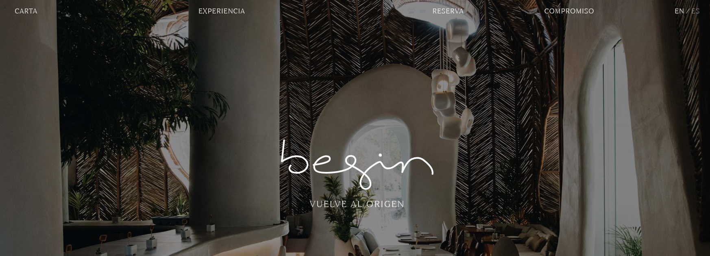

Proceso:

Me he basado en estética del restaurante begin, pero creando una versión totalmente personalizada con un nombre y logo distintos. Para ello Utilice colores oscuros de fondo, pero legibles, que aportan cercanía y ganas de sumergirte a esta idea que propone el restaurante. Intente hacer estilo minimalista en cuanto al menú, que las líneas sean finas, sin mucho ruido visual y en general con un contenido reducido, para no sobrecargar la lectura general. 

Mi página inicial:
> 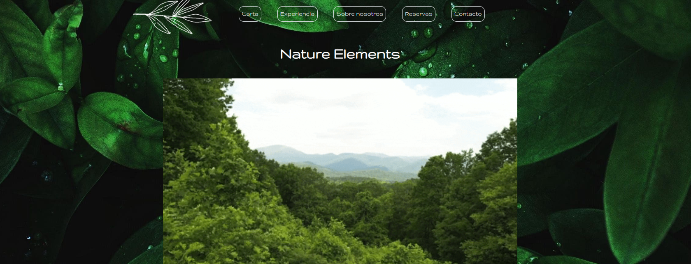

Para poder llevar a cabo realización de esta página utilice plantillas del Bootstrap, pero todo personalizado para lograr mejor diseño (añadiendo o quitando propiedades).

Navbar:
> 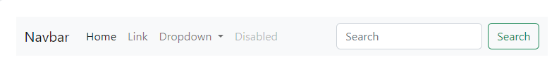
> 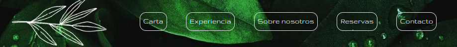

Cards:
> 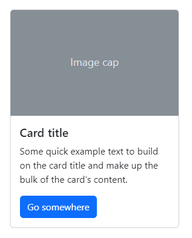 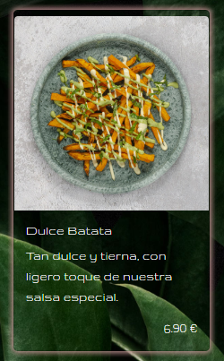

Input:
> 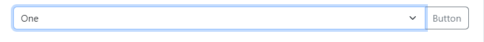
> 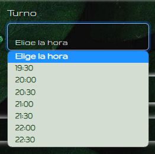

Form:
> 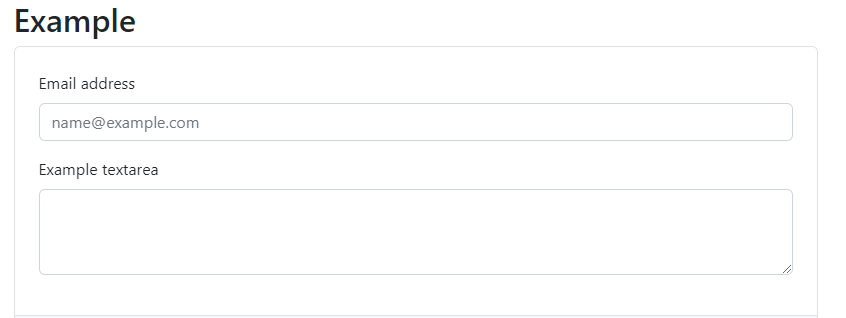
> 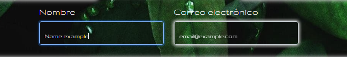

Funcionalidad:

Esta web esta adaptada para ser responsive, aquí se muestran diferentes vistas según el tamaño de la pantalla:
> 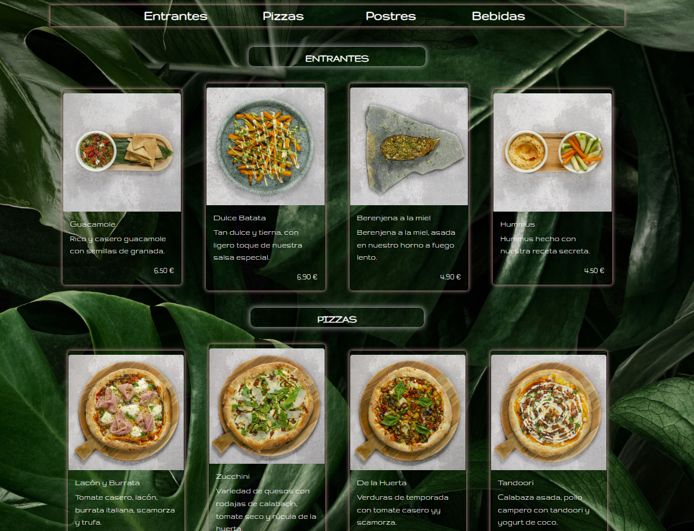
> 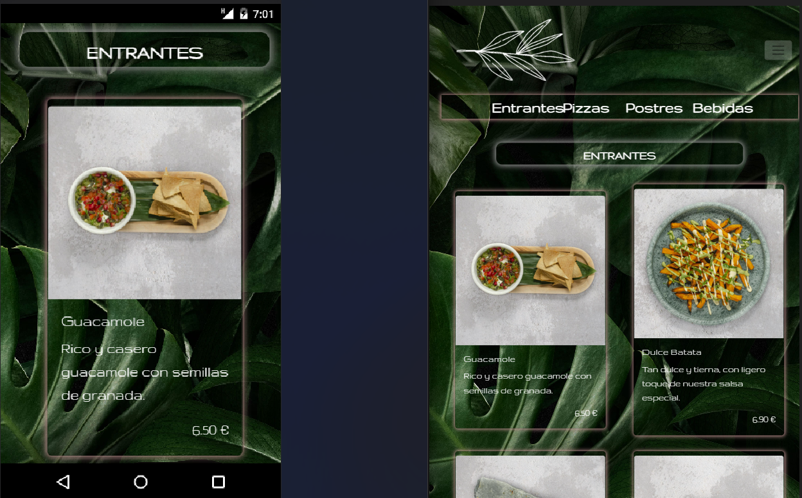

El proyecto consta de varias páginas.

Página principal:
> 

Carta del Restaurante:
> 

Sobre la experiencia que ofrece el restaurante:
> 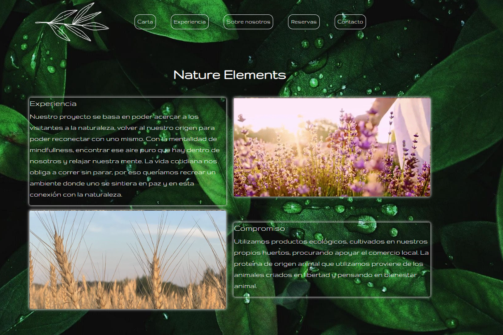

Información del propio restaurante:
> 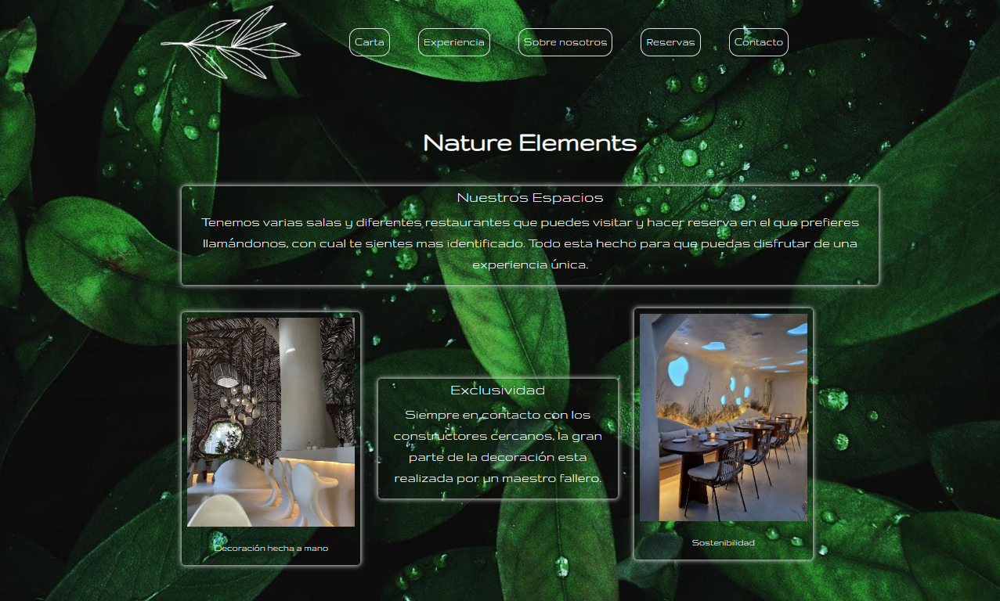

Página de reserva:
> 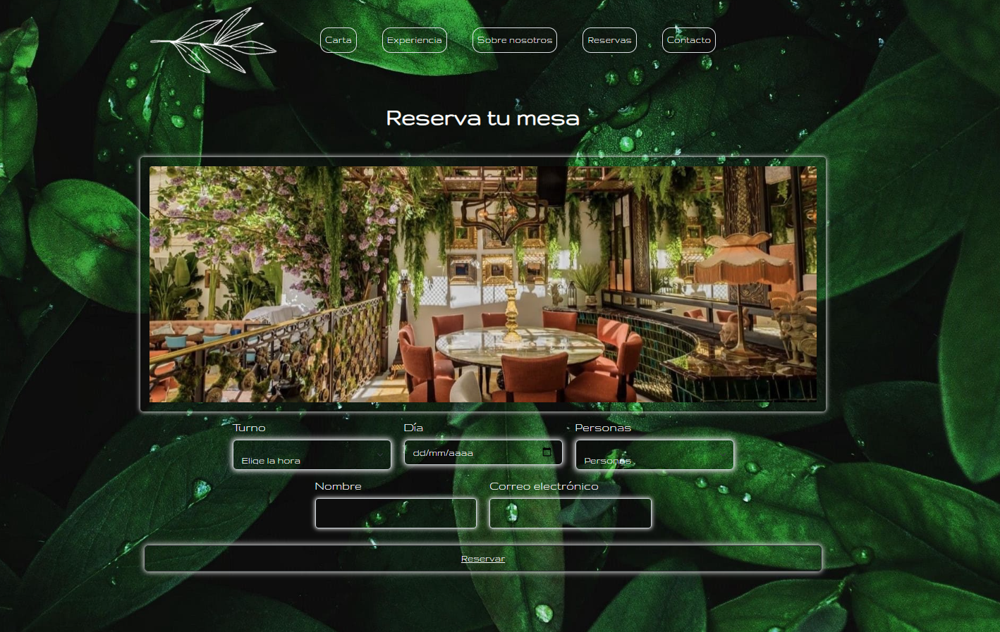

Página de contacto:
> 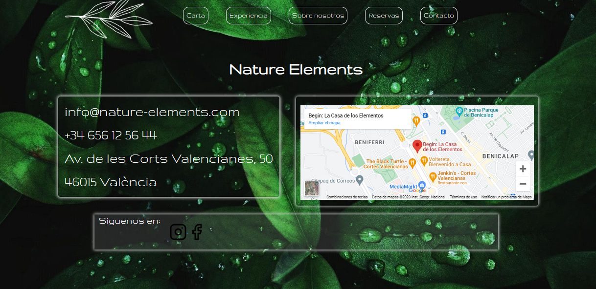

Errores conocidos:
En el formulario de reserva esta activada opción de poder gestionar una reserva introduciendo tus datos, posteriori salta una página diferente con la condirmación de la reserva. Pero esta página es ficticia, ya que no se envía a ningún sitio, ni recoge los datos introducidos.
