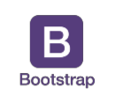

<h1 align="center">Geekshubs Academy FSD 04-2023</h1>

<h1 align="center">Second project - Restaurant</h1>

## Table of Contents

- [About project:thought_balloon:](#about-project)
- [Inspiration:sparkles:](#inspiration)
- [Process:hourglass:](#process)
- [Functionality:computer:](#functionality)
- [Errors:warning:](#errors)
- [Used technology:white_check_mark:](#used-technology)
- [License and Copyright:pencil::copyright:](#license-and-copyright)

### About project:

The project consists of creating a digital restaurant website with minimum requirements of three hyperlinked HTML pages with free theme. All this to put into practice the acquired knowledge of HTML5, CSS Layout, Bootstrap and correct use of GitHub and GitHubPages, as well as Responsive design.
	Through this link you can access the restaurant's website:
    https://anastasiakosovets.github.io/Nature-Elements/

### Inspiration:

As inspiration I took the example of the restaurant BEGIN Valencia, as well as spaces built by G+D(greendecorum). I have compiled and united several themes that they have in addition to the examples of other restaurants of the same criteria.

Image of the restaurant I took for inspiration:
> 

### Process:

I have based on the aesthetics of Begin restaurant, but creating a completely customized version with a different name and logo. For this I used dark colors in the background, but legible, that bring closeness and desire to immerse yourself in this idea that the restaurant proposes. Try to make a minimalist style in terms of the menu, that the lines are thin, without much visual noise and in general with a reduced content, so as not to overload the general reading. 

- **My home page:**
> 

In order to carry out the realization of this page I used Bootstrap templates, but all customized to achieve better design (adding or removing properties).

- **Navbar:**
> 
> 

- **Cards:**
>  

- **Input:**
> 
> 

- **Form:**
> 
> 

### Functionality:

This website is adapted to be responsive, here are shown different views according to the size of the screen:
> 
> 

**The project has several pages.**

***My home page:***
> 

***Restaurant's Menu:***
> 

***About the restaurant's experience:***
> 

***Information from the restaurant:***
> 

***Booking page:***
> 

***Contact Us Page:***
> 

### Errors:
In the booking form is activated option to manage a reservation by entering your data, then we go to a different page with the confirmation of the reservation. But this page is fictitious, since it is not sent to any site, nor does it collect the data entered.

### Font:
- Gruppo https://fonts.google.com/specimen/Gruppo

### Used technology

### License and Copyright

*Images are property of the restaurant Begin Valence https://beginrestaurante.com/ y G+D(greendecorum) https://greendecorum.com/* 
